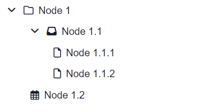

# Overview

The React tree component offers a versatile and customizable solution for displaying hierarchical data in web applications.

## tree component



| Name       | Type  | Required | Description                                   |
| ---------- | ----- | -------- | --------------------------------------------- |
| dataSource | Array | Yes      | The dataSource that contains data to display. |

### Datasource

| Name     | Attribute | Type   | Required | Description                                            |
| -------- | --------- | ------ | -------- | ------------------------------------------------------ |
| Key      | key       | String | Yes      | Unique identifier for the node.                        |
| Label    | label     | String | Yes      | The label or display name for the node.                |
| Icon     | icon      | String | No       | Icon representing the node (e.g., Font Awesome class). |
| Url      | url       | String | No       | url link if it is a last element                       |
| Webform  | webform   | String | No       | webform loader id                                      |
| Target   | target    | String | No       | webform name to be displayed in the webform loader     |
| Children | children  | Array  | No       | An array of child nodes belonging to the current node. |

Example of data that can be used :

```
[
  {
    "key": "1",
    "label": "Folder 1",
    "icon": "fa-solid fa-folder",
    "children": [
      {
        "key": "1-1",
        "label": "Subfolder 1",
        "icon": "fa-solid fa-folder",
        "children": [
          {
            "key": "1-1-1",
            "label": "File 1",
            "icon": "fa-solid fa-file"
          },
          {
            "key": "1-1-2",
            "label": "File 2",
            "icon": "fa-solid fa-file"
          }
        ]
      },
      {
        "key": "1-2",
        "label": "Subfolder 2",
        "icon": "fa-solid fa-folder",
        "webform": "kS4j2Iu8Mv",
        "target": "home"
      }
    ]
  },
  {
    "key": "2",
    "label": "Folder 2",
    "icon": "fa-solid fa-folder"
    "url": "www.google.com"
  }
]
```
